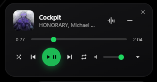
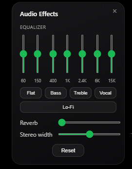

# SpotiFloat

A compact, frameless, always-on-top floating player for Spotify's web player. Drag it anywhere on your screen, control playback without switching tabs or windows, and shape the sound with your own EQ/reverb/stereo-widener effects that Spotify itself doesn't offer.

 

## Features

- Frameless, rounded, always-on-top widget — stays visible over any application, not just your browser
- Play/pause, next/previous, seek, and volume
- Shuffle and repeat (off/all/one), with an "up next" queue dropdown you can click to jump to any track
- Compact mode for a minimal thumbnail + transport-only view
- A separate audio effects window: 7-band equalizer with presets, reverb, and a stereo widener — all custom DSP running in the browser tab, not a Spotify feature
- Remembers window position between launches
- Everything runs locally — no accounts, no Spotify API keys, no cloud, no telemetry

This needs **two separate installs to work**: a browser extension, and a small desktop app. Both are required — see [why](#how-it-works) below.

## Quick start

### Step 1 — Install the browser extension

1. Click the green **Code** button near the top of this page → **Download ZIP**.
2. Find the downloaded ZIP file (usually in your `Downloads` folder) and **extract it**.
3. Open `chrome://extensions` (or your Chromium browser's equivalent — Edge, Brave, Opera all use the same path pattern).
4. Turn on **Developer mode** (top-right corner).
5. Click **Load unpacked** and select the extracted folder (the one with `manifest.json` directly inside it).
6. You should now see "SpotiFloat" appear as a card on that page. Leave Developer mode on — turning it off disables unpacked extensions until you turn it back on.

### Step 2 — Install the companion app

1. Go to the [Releases page](../../releases) and download the latest `SpotiFloat Setup x.x.x.exe`.
2. Run the downloaded installer.
3. **Windows may show a blue "Windows protected your PC" warning.** This is normal for small independent apps that haven't paid for a code-signing certificate — it does **not** mean anything is wrong. Click **More info**, then **Run anyway**.
4. Click through the installer and finish.

A small floating widget should appear (bottom-right of your screen by default), plus a tray icon.

### Step 3 — Use it

1. Open `open.spotify.com` and start playing a track.
2. The widget should show the track's title, artist, and album art.
3. Drag the widget anywhere by its body (no title bar needed).
4. Play/pause, skip, seek, shuffle, repeat, and volume all work directly from the widget.
5. Click the sliders icon to open the audio effects window; click the dropdown arrow to expand the queue.

## Troubleshooting / FAQ

**The widget shows "Not playing" and never updates.**
Make sure the companion app is running (check your system tray) and that `chrome://extensions` still shows SpotiFloat enabled with Developer mode on. Try refreshing the `open.spotify.com` tab.

**I closed the widget and can't get it back.**
Click the SpotiFloat tray icon and choose "Show/Hide", or click the extension's toolbar icon (pin it first via the puzzle-piece icon if needed).

**The queue dropdown says "Queue unavailable".**
Open Spotify's own queue panel at least once in the tab so it loads into the page — the widget reads it from there, and doesn't open it for you automatically.

**Audio effects don't seem to do anything.**
Fully refresh the `open.spotify.com` tab after installing/updating the extension — the effects engine has to attach itself while the page first loads, so it needs a real reload, not just a soft extension reload.

**Nothing happens when I click the extension's toolbar icon.**
Make sure you're clicking the icon in the browser toolbar, not something on the `chrome://extensions` page, and that it's pinned via the puzzle-piece icon.

**Windows says "Windows protected your PC" when I try to install.**
This is expected — the installer isn't code-signed (that costs money and isn't worth it for a small personal project). Click **More info** → **Run anyway**. If you're not comfortable with that, you can build the app yourself from source instead (see [Building from source](#building-from-source)) so you know exactly what's running.

## How it works

There's no official third-party API for Spotify's web player, so this project is two parts working together:

1. **A browser extension** injected into `open.spotify.com` that reads/drives the real page — track metadata and transport buttons via `data-testid` attributes, the queue panel's DOM, and (separately) a script injected into the page's own JS context that builds a custom Web Audio effects chain.
2. **A small Electron desktop app** that renders the floating widget and a separate effects window. This is necessary because browser extensions cannot create frameless or always-on-top windows — that's a hard platform restriction. The two talk to each other over a local WebSocket (`127.0.0.1` only, nothing leaves your machine).

### The audio effects engine

Spotify's web player has no `<audio>`/`<video>` element reachable via normal DOM queries (it's not exposed to `document.querySelector`), so the effects engine (`content/spotify-main-world.js`) intercepts `document.createElement` in the page's own JS context to grab a reference to the element the instant Spotify creates it, then routes it through a `MediaElementAudioSourceNode` into a Web Audio graph: EQ (`BiquadFilterNode` chain) → reverb (`ConvolverNode` with a procedurally generated impulse response, no external audio file) → stereo widener (mid-side processing via channel splitter/merger). This has to run at `document_start` in the page's main JS world, before Spotify's own bundle runs, or the interception is too late.

### Slider-to-DOM tricks

Spotify's seek bar and volume slider are React-controlled `<input type="range">` elements — setting `.value` directly is silently ignored by React's change detection, so the extension goes through the native `HTMLInputElement` value setter and dispatches real `input`/`change` events to get React to notice.

## Building from source

**Companion app:**
```
cd companion-app
npm install
npm start
```

To build your own installer instead of running from source:
```
cd companion-app
npm install
npm run dist
```
The installer will be in `companion-app/dist/`.

**Extension:** no build step — load the repository root directly as described in [Step 1](#step-1--install-the-browser-extension) above.

The companion app lives in your system tray — leave it running. Add a shortcut to it in your Windows Startup folder (`shell:startup`) if you want it to launch automatically on login.

## Project structure

```
manifest.json                       Extension manifest
background.js                       Service worker: tab lifecycle, WebSocket bridge
content/spotify-selectors.js        Isolated selector module -- patch this first if something breaks
content/spotify-bridge.js           Isolated-world content script: reads/drives the Spotify page
content/spotify-main-world.js       Main-world script: audio effects engine
companion-app/                      Electron app rendering the floating widget and FX window
```

## Known limitations

- The extension alone shows nothing — the companion app must be running, since a browser extension cannot create a frameless/always-on-top window.
- Relies on scraping Spotify's DOM. Most selectors use `data-testid` attributes (relatively stable), but the queue panel has no `data-testid` at all and is matched against Spotify's internal Encore design-system classes and ARIA roles, which are more likely to drift across releases. If something breaks, `content/spotify-selectors.js` is the first place to look — PRs to fix drifted selectors are welcome.
- The audio effects engine relies on intercepting `document.createElement`, an unofficial technique (also used by other open-source Spotify audio-effect extensions) that could break if Spotify changes how it constructs its media element.
- You need to already be logged into Spotify in your browser profile; this project doesn't handle sign-in.

## Contributing

Issues and pull requests are welcome, especially fixes for Spotify DOM/selector drift.
