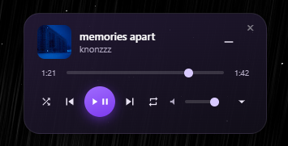

# YTM Float

A compact, frameless, always-on-top floating player for YouTube Music. Drag it anywhere on your screen, control playback without switching tabs or windows, and control it straight from Opera GX's built-in sidebar YTM panel instead of needing a dedicated browser tab.



## Features

- Frameless, rounded, always-on-top widget — stays visible over any application, not just your browser
- Play/pause, next/previous, seek, volume, shuffle, and repeat
- Expandable "up next" queue with thumbnails, click to jump to any track
- Compact mode for a minimal thumbnail + transport-only view
- Works from a normal tab, a background tab, **or Opera GX's sidebar YTM panel**
- Remembers window position between launches
- Everything runs locally — no accounts, no cloud, no telemetry

This needs **two separate installs to work**: a browser extension, and a small desktop app. Both are required — see [why](#how-it-works) below. Follow the steps exactly and it takes under 5 minutes.

## Quick start (for everyone)

### Step 1 — Install the browser extension

1. Click the green **Code** button near the top of this page → **Download ZIP**.
2. Find the downloaded ZIP file (usually in your `Downloads` folder) and **extract it** (right-click → "Extract All...").
3. Open Opera GX. In the address bar, type `opera://extensions` and press Enter.
4. In the top-right corner of that page, turn on **Developer mode**.
5. Click the **Load unpacked** button that appears.
6. In the folder picker, navigate into the folder you extracted, then select the folder that has `manifest.json` directly inside it (this is usually named something like `YTMFloat-Electron+extension`), and click **Select Folder**.
7. You should now see "YTM Float" appear as a card on that page. Leave Developer mode turned on — if you turn it off later, the extension stops working until you turn it back on.

### Step 2 — Install the companion app

1. Go to the [Releases page](../../releases) and download the latest `YTM Float Setup x.x.x.exe`.
2. Run the downloaded installer.
3. **Windows may show a blue "Windows protected your PC" warning.** This is normal for small independent apps that haven't paid for a code-signing certificate — it does **not** mean anything is wrong. Click **More info**, then click **Run anyway**.
4. Click through the installer (choose an install location if you want, or just leave the default) and finish.
5. YTM Float should launch automatically after install, or you can find it in your Start menu.

You'll see a small floating widget appear (probably in the bottom-right of your screen), and a new icon in your system tray (the small icons near your clock, bottom-right of the taskbar — click the little upward arrow `^` there if you don't see it).

### Step 3 — Use it

1. Open Opera GX's YouTube Music sidebar (or any `music.youtube.com` tab) and start playing a song.
2. The floating widget should now show the song's title, artist, and thumbnail.
3. Drag the widget anywhere on your screen by clicking and holding on its body.
4. That's it — play/pause, skip, seek, and volume all work directly from the widget.

## Troubleshooting / FAQ

**The widget shows "Not playing" and never updates.**
Make sure the companion app is actually running — check your system tray for its icon. If it's not there, launch YTM Float again from your Start menu. Also make sure `opera://extensions` still shows YTM Float enabled and Developer mode is still on.

**I closed the widget and can't get it back.**
Click the YTM Float icon in your system tray and choose "Show/Hide". You can also click the extension's toolbar icon in Opera GX (you may need to pin it first — click the puzzle-piece icon next to the address bar).

**Windows says "Windows protected your PC" when I try to install.**
This is expected — the installer isn't code-signed (that costs money and isn't worth it for a small personal project). Click **More info** → **Run anyway**. If you're not comfortable with that, you can build the app yourself from source instead (see [Building from source](#building-from-source)) so you know exactly what's running.

**Nothing happens when I click the extension's toolbar icon.**
Make sure you're clicking the actual icon in the browser toolbar next to the address bar — not something on the `opera://extensions` settings page. You may need to pin the extension first via the puzzle-piece icon.

**The queue dropdown says "Queue unavailable".**
Open the actual queue panel in YouTube Music at least once (sidebar or tab) so it loads into the page — the widget reads it from there.

**Some songs are missing a thumbnail in the queue.**
This should be rare and self-corrects within a second or two as YouTube Music loads it — no action needed.

**I turned off Developer mode by accident and now it's broken.**
Turn it back on at `opera://extensions`. Chromium browsers disable all unpacked (non-store) extensions whenever Developer mode is off.

## How it works

There's no official third-party API for YouTube Music, so this project is two parts working together:

1. **A browser extension** that's injected into `music.youtube.com` (wherever it's running, including Opera's sidebar panel) and reads/drives the real page — song metadata, the YouTube player API, and the queue panel's internal data.
2. **A small Electron desktop app** that renders the actual floating widget. This is necessary because browser extensions cannot create frameless or always-on-top windows — that's a hard platform restriction, not a missing feature. The two talk to each other over a local WebSocket (`127.0.0.1` only, nothing leaves your machine).

## Building from source

**Companion app:**
```
cd companion-app
npm install
npm start
```

To build your own installer instead of downloading one:
```
cd companion-app
npm install
npm run dist
```
The installer will be in `companion-app/dist/`.

**Extension:** no build step — load the repository root directly as described in [Step 1](#step-1--install-the-browser-extension) above.

The companion app lives in your system tray — leave it running. Add a shortcut to it in your Windows Startup folder (`shell:startup`) if you want it to launch automatically on login.

## Usage

- Play music from any `music.youtube.com` tab, a pinned tab, or Opera GX's sidebar panel — the widget follows whichever one is currently reporting playback.
- Drag the widget anywhere by its body (no title bar needed).
- Click the dropdown arrow to expand the upcoming queue; click any track to jump to it.
- Click the compact-mode button to shrink the widget down to just the thumbnail and transport controls.
- Click the × to hide the widget to the tray; bring it back via the tray icon or the extension's toolbar icon.

## Project structure

```
manifest.json              Extension manifest
background.js              Service worker: tab lifecycle, WebSocket bridge
content/ytm-bridge.js       Reads/controls the YouTube Music page
content/ytm-main-world.js   Reads queue data the isolated content script can't see
companion-app/              Electron app rendering the floating widget
```

## Known limitations

- The extension alone shows nothing — the companion app must be running, since a browser extension cannot create a frameless/always-on-top window.
- Relies on scraping YouTube Music's DOM, its internal Polymer data model, and its internal player API. If Google changes any of these internals, something may break until selectors are updated — PRs welcome.
- You need to already be logged into YouTube Music in your browser profile; this project doesn't handle sign-in.

## Contributing

Issues and pull requests are welcome, especially fixes for YouTube Music DOM/selector changes.
